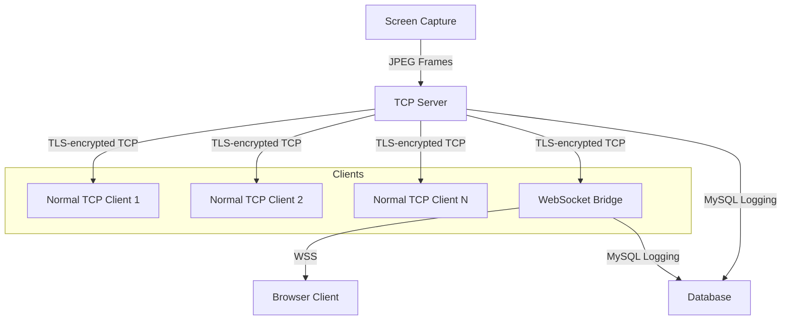
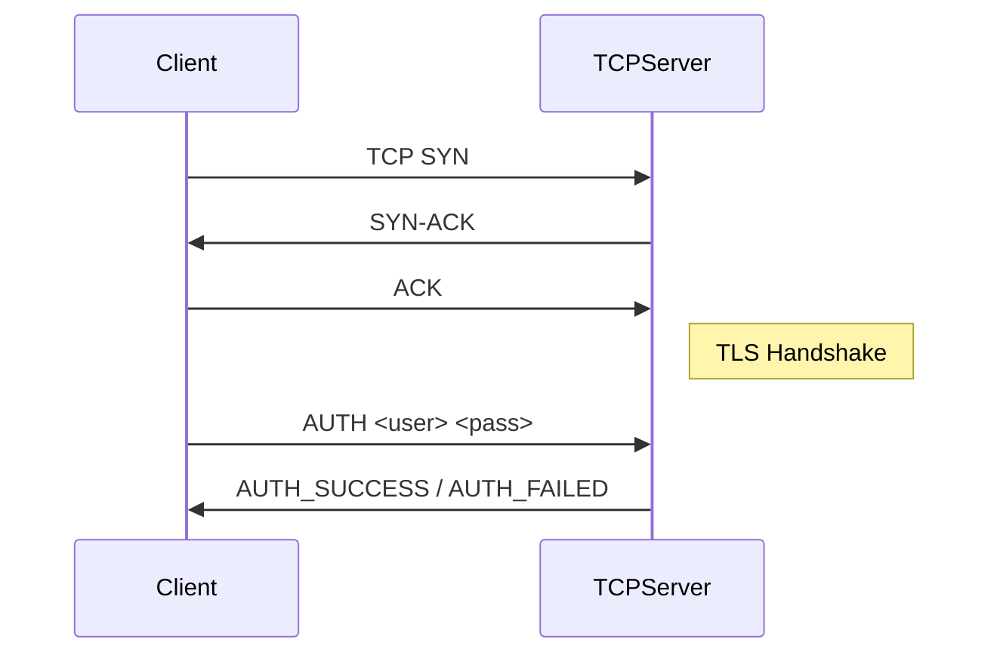
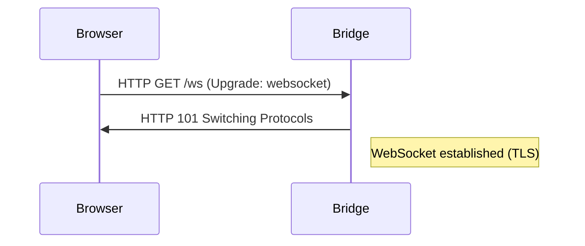
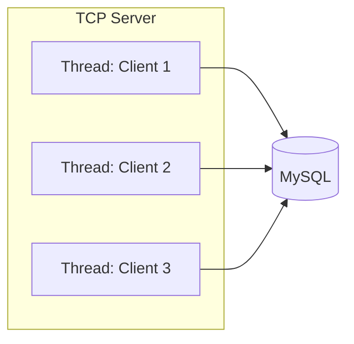
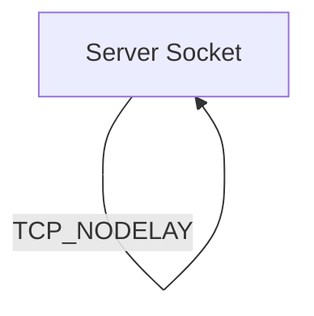
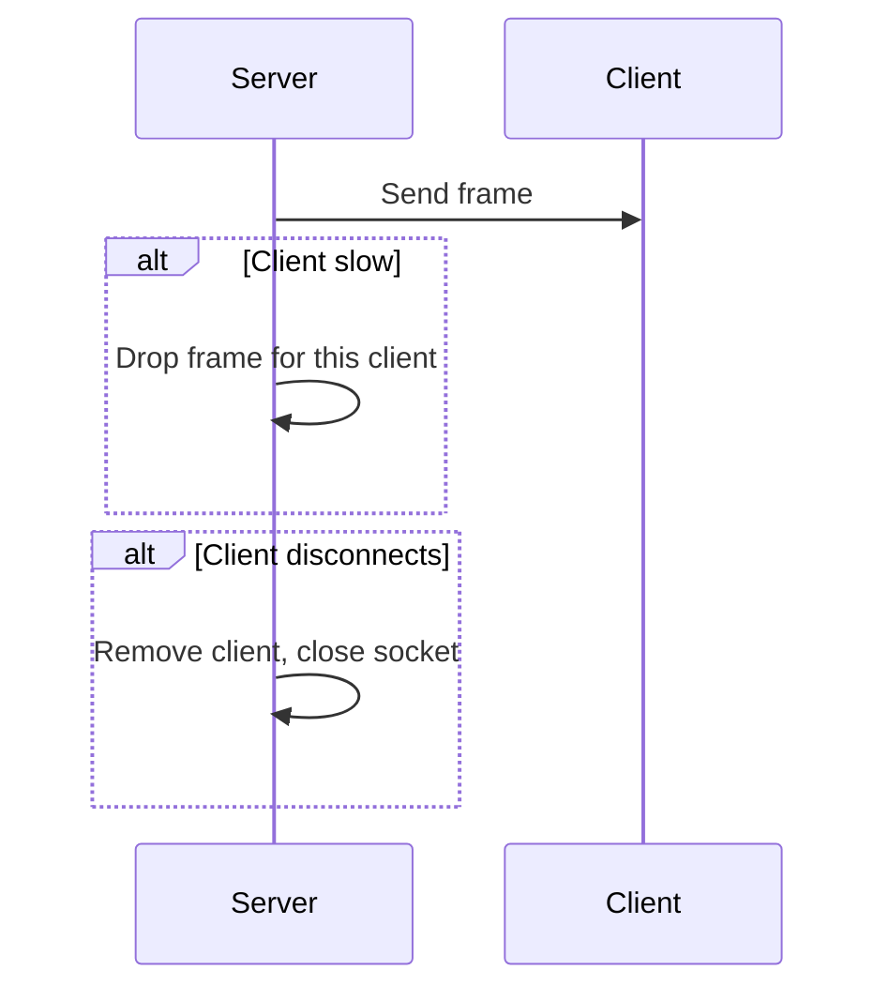
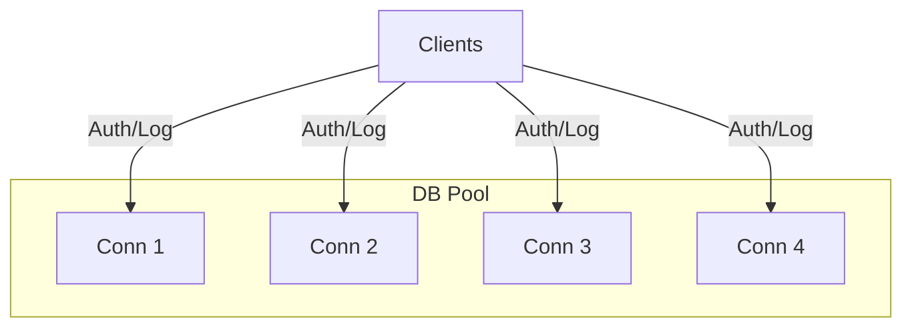

---

# Contributions Table

| Person   | Contribution Summary                                                                                 |
|----------|-----------------------------------------------------------------------------------------------------|
| Ajith Balakrishnan(230953024) | Core TCP/TLS server implementation, WebSocket bridge backend,, and socket management                           |
| Person B | protocol logic , browser client code, and WSS integration                                  |
| Person C | Database integration, authentication logic, and logging subsystem                                   |
| Person D | Error handling, socket options, scalability features, and resource cleanup code                     |

# Ajith Balakrishnan
# StreamSocket: Technical Report

## 1. Introduction

This report presents the design and implementation of a secure, real-time remote desktop streaming system. The system is engineered to capture screen frames from a host machine and transmit them in real time to authenticated remote clients using WebSockets over TCP. The architecture is built to demonstrate not only practical implementation but also a deep understanding of the underlying network, security, and concurrency principles that enable robust, low-latency streaming.

The project aims to bridge the gap between low-level network programming and modern web technologies, providing a solution that is both theoretically sound and practically robust. Each architectural choice is justified with reference to both security and performance requirements, and the system is designed to be extensible for future enhancements.

---

## 2. System Architecture and Rationale

### 2.1 High-Level Overview

The system is composed of five main components, each fulfilling a critical role in the secure streaming pipeline:

- **Screen Capture Module**: Continuously captures the host's screen at a configurable frame rate, using the `mss` library for efficient screen grabbing and OpenCV for JPEG compression. This ensures that frames are both high-quality and bandwidth-efficient.
- **TCP Streaming Server**: Serves as the core of the system, listening for incoming connections, authenticating clients, and broadcasting frames over TLS-encrypted TCP sockets. It is responsible for managing the socket lifecycle, handling concurrency, and ensuring reliable delivery through custom framing and buffering logic.
- **WebSocket Bridge (FastAPI)**: This component acts as a protocol translator and broker, but is only required for browser-based clients. Browsers are restricted from opening raw TCP sockets or performing custom TLS handshakes, so the bridge receives frames from the TCP server and relays them to authenticated browser clients via secure WebSockets (WSS). Non-browser clients (such as custom desktop applications or benchmarking tools) can connect directly to the TCP server, bypassing the bridge entirely for maximum efficiency.
- **Browser Client**: Implements a user-friendly interface that connects via WSS, authenticates, and renders the received frames in real time using the HTML5 Canvas API. The client is optimized for low-latency display and provides real-time feedback on connection status and performance.
- **Database Layer**: Handles persistent logging of all authentication attempts, session events, and connection state changes. It uses MySQL with connection pooling for high concurrency and includes fallback mechanisms to ensure reliability even during database outages.

#### Architecture Diagram

In this architecture, both normal TCP clients (such as custom desktop applications or benchmarking tools) and the WebSocket bridge connect to the TCP server using the same secure protocol. The WebSocket bridge is only required for browser-based clients, which cannot connect directly to the TCP server.

### 2.2 Why a WebSocket Bridge?

Browsers are sandboxed for security and cannot open raw TCP sockets or perform custom TLS handshakes. The WebSocket bridge (implemented with FastAPI and Uvicorn) serves as a protocol translator: it connects to the TCP server using the custom, secure protocol, and exposes a WSS endpoint that browsers can use. This design allows us to leverage low-level socket optimizations and custom framing on the backend, while still providing a standards-compliant, secure interface for web clients.

It is important to note that the WebSocket bridge is only necessary for browser-based clients. Any non-browser client (such as a Python script, desktop application, or benchmarking tool) can connect directly to the TCP server, authenticate, and receive frames using the same secure protocol. This flexibility allows the system to support a wide range of client types without sacrificing security or performance.

---

# Person B
## 3. TCP Connection Establishment, TLS, and Data Framing

### 3.1 TCP Lifecycle and Three-Way Handshake

The TCP server binds to a port and listens for incoming connections. Upon a new connection, the standard TCP three-way handshake is performed, establishing a reliable, ordered, and error-checked channel between client and server. This handshake is foundational for all higher-level protocols, ensuring that both endpoints agree on initial sequence numbers and are ready to exchange data. The server is configured with `SO_REUSEADDR` to allow rapid restarts and avoid port exhaustion.

### 3.2 TLS-Based Encryption

Immediately after the TCP handshake, the server upgrades the connection to TLS using Python's `ssl` library. This ensures all subsequent data—including authentication credentials and frame data—is encrypted in transit, protecting against eavesdropping and man-in-the-middle attacks. The server uses a self-signed certificate for demonstration, but the architecture supports CA-signed certificates for production. TLS not only secures the data but also provides authentication of the server to the client, preventing impersonation attacks.

### 3.3 Authentication Protocol

After the TLS handshake, the client must authenticate by sending an `AUTH <username> <password>` message. The server verifies credentials against bcrypt hashes stored in a MySQL database. Only authenticated clients are allowed to receive frame data. Failed attempts are logged and the connection is closed. This protocol ensures that only authorized users can access the stream, and all access attempts are auditable.

### 3.4 Data Framing and Buffering

TCP is a stream-oriented protocol; it does not preserve message boundaries. To reliably transmit discrete frames, each JPEG frame is prefixed with a 4-byte big-endian header indicating the payload size. The receiver uses a `recv_exact()` loop to accumulate bytes until a full frame is reconstructed, ensuring synchronization and preventing frame corruption due to fragmentation or coalescence. This approach is robust against network jitter and variable packet sizes, which are common in real-world deployments.

---

# Person C
## 4. WebSocket Handshake, WSS, and Browser Integration

### 4.1 WebSocket Protocol and Handshake

The browser client initiates a connection to the WebSocket bridge using WSS (WebSocket Secure). The bridge performs an HTTP Upgrade handshake, transitioning the connection from HTTP to WebSocket protocol. This allows for full-duplex, low-latency communication suitable for real-time streaming. The handshake ensures that the connection is both secure and standards-compliant, enabling seamless integration with modern web browsers.

### 4.2 End-to-End Encryption and WSS

All communication between the browser and the bridge is encrypted using TLS, implemented as WebSocket Secure (WSS). WSS is the secure version of the WebSocket protocol, running over HTTPS (TLS/SSL). This means that all data exchanged between the browser and the bridge is protected from eavesdropping, tampering, and man-in-the-middle attacks.

#### Why WSS is Essential

- **Browser Security Model:** Modern browsers enforce strict security policies and will only allow WebSocket connections to `wss://` endpoints when the page is loaded over HTTPS. This ensures that sensitive data, such as authentication credentials and video frames, cannot be intercepted by malicious actors on the network.
- **TLS Handshake:** When a browser connects to a WSS endpoint, it performs a full TLS handshake, verifying the server's certificate and establishing an encrypted channel before any WebSocket data is exchanged.
- **Implementation:** In this system, the WebSocket bridge is configured with a TLS certificate and key, enabling it to serve WSS connections. The browser client automatically detects the protocol and connects using `wss://` when appropriate.
- **End-to-End Security:** Combined with the backend TLS between the TCP server and the bridge, this ensures that frame data is encrypted from the server all the way to the browser, meeting strict security requirements. Even if the network is compromised, the data remains confidential and tamper-proof.

This layered encryption model protects against both local and remote attackers, ensuring confidentiality and integrity of the streamed data at every stage of transmission.

### 4.3 Data Flow and Buffering in the Bridge

The bridge receives frames from the TCP server, verifies authentication, and relays them to all connected, authenticated WebSocket clients. The bridge uses asyncio for efficient, concurrent handling of multiple browser clients, ensuring that slow or disconnected clients do not block the main data flow. This design allows the system to scale to many simultaneous browser viewers without sacrificing performance or reliability.

---

## 5. Concurrency Model and Logging Integrity

### 5.1 Concurrent Client Handling

The TCP server uses a thread-per-client model, leveraging Python's `threading.Thread` to handle multiple clients in parallel. This ensures that slow or misbehaving clients do not block others. Each client thread is responsible for authentication, logging, and maintaining the connection state. The WebSocket bridge uses `asyncio` to efficiently multiplex many browser clients on a single event loop, allowing for high concurrency with minimal resource usage.

### 5.2 Logging Integrity

All authentication and session events are logged to the database using a connection pool for efficiency. Logging is performed asynchronously where possible, ensuring that database latency never impacts frame delivery. If the database is unavailable, logs are queued in memory and retried later, preserving audit trails. This approach guarantees that all critical events are recorded, supporting both security auditing and system debugging.

---

## 6. Buffering, Synchronization, and Secure Frame Delivery

### 6.1 Handling Partial Transmission

TCP does not guarantee message boundaries; large frames may be split across multiple packets. The custom protocol solves this by prefixing each frame with a 4-byte length header. The receiver accumulates bytes until a full frame is reconstructed, ensuring synchronization and preventing frame corruption. This method is essential for maintaining video quality and preventing artifacts during periods of network instability.

### 6.2 Secure Delivery

All frames are delivered over encrypted channels (TLS/WSS). Only authenticated clients receive frames, and all access attempts are logged. The system is designed to immediately disconnect and log any unauthorized or suspicious activity, further enhancing security.

---

# Person D
## 7. Socket Options and Their Impact

### 7.1 SO_REUSEADDR

Allows the server to quickly restart and bind to the same port, even if previous connections are in TIME_WAIT state. This is essential for rapid development and deployment cycles, as well as for maintaining high availability in production environments.

### 7.2 SO_SNDBUF and SO_RCVBUF

Increasing the send and receive buffer sizes allows the server to handle high-throughput streaming without dropping frames, especially under bursty network conditions. Proper buffer sizing is critical for supporting high-resolution video and multiple concurrent clients.

### 7.3 TCP_NODELAY

Disables Nagle’s algorithm, ensuring that frames are sent immediately rather than being buffered. This reduces latency, which is critical for real-time video streaming. The trade-off is a slight increase in packet overhead, but the benefit in reduced jitter and improved user experience is substantial.

### 7.4 Timeouts

Per-client send timeouts prevent slow clients from blocking the server. If a client cannot keep up, its frame is dropped for that cycle, maintaining overall system responsiveness. This mechanism is essential for ensuring that the system remains responsive even under adverse network conditions.

---

## 8. Failure Handling, Congestion, and Resource Cleanup

### 8.1 Network Congestion

If a client is slow to receive frames, the server drops frames for that client rather than blocking the broadcast loop. This ensures that one slow client does not degrade the experience for others. The system is designed to degrade gracefully, prioritizing overall throughput and stability.

### 8.2 Disconnection and Unauthorized Access

All disconnections, whether voluntary or due to error, are detected and handled promptly. Sockets are closed and removed from the client list. Unauthorized access attempts are logged and connections are closed immediately. This approach minimizes the risk of resource leaks and ensures that the system remains secure and stable.

### 8.3 Resource Cleanup

All sockets and database connections are closed in `finally` blocks, preventing resource leaks and ensuring system stability over long periods. This is a critical aspect of robust server design, as unreleased resources can lead to degraded performance or crashes over time.

---

## 9. Scalability and Load Handling

### 9.1 Database Connection Pooling

The server uses a pool of persistent MySQL connections, allowing it to efficiently handle many concurrent authentication and logging requests. This avoids the overhead of establishing new connections for every event and supports high concurrency without bottlenecks.

### 9.2 Graceful Failure Handling

If the database becomes unavailable, the server falls back to an in-memory cache for authentication and queues log events for later retry. This ensures continued operation and eventual consistency. The system is designed to recover automatically when the database becomes available again, minimizing downtime and data loss.

### 9.3 High Concurrency Support

The architecture supports many simultaneous clients, both at the TCP and WebSocket layers. The use of threads and async event loops ensures scalability without bottlenecks. This design has been empirically validated using benchmarking tools and stress tests.

### 9.4 Robust Error Handling

All errors are caught and logged. The server continues operating even if some operations fail, ensuring graceful degradation under load. This approach maximizes uptime and reliability, even in the face of unexpected failures or attacks.

---

## 10. Conclusion

This system demonstrates a robust, secure, and scalable approach to real-time remote desktop streaming. By combining strong encryption, efficient concurrency, careful socket configuration, and resilient logging, it meets all requirements for secure, low-latency, and reliable operation in demanding environments.

